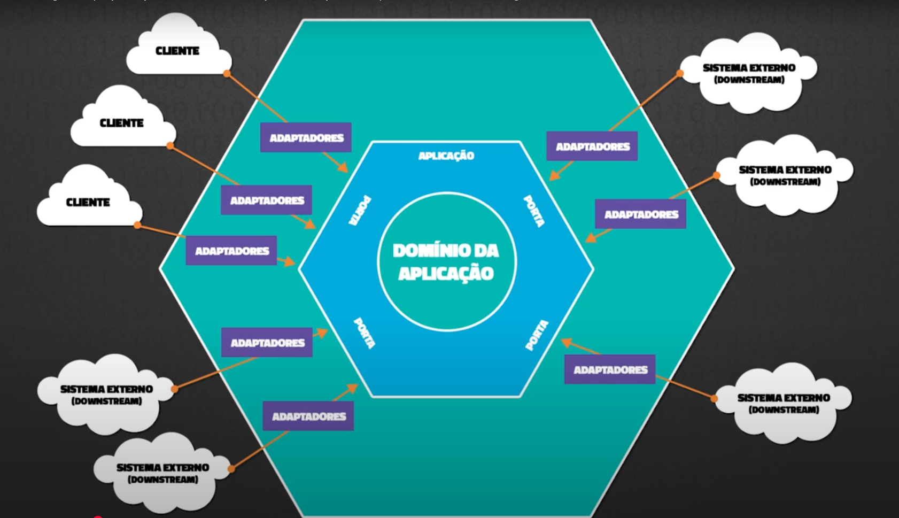

# 🔷 Ports and Adaptors (Arquitetura Hexagonal) com Node.js + TypeScript + Prisma

Uma prova de conceito simples de **Arquitetura Hexagonal (Ports & Adapters)**, desenvolvida em Node.js com TypeScript.

# 🏛️ INTRODUÇÃO

A arquitetura hexagonal (ou Ports & Adapters), criada por Alistair Cockburn em 2005, tem como objetivo isolar as regras de negócio do sistema de qualquer dependência externa, como frameworks, bancos de dados ou APIs. O nome vem da ideia visual de conectar diferentes “lados” da aplicação por meio de portas (interfaces) e adaptadores (implementações). Isso torna o sistema mais modular, testável e fácil de manter.



## 🚀 Como Rodar a Aplicação

Este projeto é uma PoC com suporte para dois tipos de repositório:

- 🧪 **Repositório em memória** (fake): não precisa de banco de dados nem `.env`.
- 🧱 **Repositório com Prisma (SQLite)**: utiliza um banco real, exige `.env`, migrações e execução do Prisma antes de rodar.

---

### 1️⃣ Rodar com repositório em memória (modo mais simples)

> ✅ Não precisa configurar banco nem `.env`

```bash
npm install
npm run dev
```

> O console exibirá o fluxo de registro e login de um cliente fictício usando um array local em memória.

---

### 2️⃣ Rodar com banco de dados (Prisma + SQLite)

> ✅ Usa banco SQLite  
> ❗️ Requer configuração de `.env` + migrações do Prisma

#### 🧾 Requisitos

- Node.js 18+
- Arquivo `.env` com o seguinte conteúdo:

```env
DATABASE_URL="file:./src/infrastructure/db/prisma/dev.db"
```

#### 🔧 Etapas para rodar com banco de dados

```bash
# Instale dependências
npm install

# Gere o client do Prisma
npm run prisma:generate

# Rode as migrações para criar o banco
npm run prisma:migrate

# Inicie a aplicação com o banco ativo
npm run dev
```

> ⚠️ É importante rodar `prisma:generate` e `prisma:migrate` antes de `npm run dev`, ou o banco não estará disponível.

---

## 📦 Scripts disponíveis

| Script               | Descrição                                 |
|----------------------|-------------------------------------------|
| `npm run dev`        | Executa com `ts-node` e recarrega mudanças |
| `npm run start`      | Executa versão compilada com Node.js       |
| `npm run build`      | Compila o projeto TypeScript               |
| `npm run prisma:*`   | Comandos utilitários do Prisma             |

---

## 📁 Estrutura de Pastas

```
src/
├── index.ts                          # Ponto de entrada da aplicação
│
├── adapters/
│   ├── http/
│   │   └── clientController.ts       # Controller HTTP de cliente
│   │
│   ├── providers/
│   │   └── bcrypt.provider.ts        # Provedor de hash usando bcrypt
│   │
│   └── repositories/
│       ├── clientInMemoryRepository.ts   # Repositório fake (memória)
│       └── clientPrismaRepository.ts     # Repositório real (Prisma)
│
├── application/
│   ├── ports/                          
│   │   ├── providers/                  # Contratos de providers (ex: hash)
│   │   └── repositories/
│   │       └── clientRepository.ts     # Contrato do repositório de cliente
│   │
│   └── use-cases/
│       ├── insertTelephoneToClient.ts   # Caso de uso: adicionar telefone
│       └── removeTelephoneByClient.ts   # Caso de uso: remover telefone
│
├── domain/
│   ├── client.ts                      # Entidade de cliente
│   └── telephone.ts                   # Entidade de telefone
│
└── infrastructure/
    ├── server.ts                      # Inicialização do servidor HTTP
    │
    └── db/
        ├── database.ts                # Conexão com banco via Prisma
        │
        └── prisma/                    # Diretório padrão do Prisma
            ├── dev.db                 # Banco SQLite local
            ├── schema.prisma          # Definição do schema Prisma
            └── migrations/            # Migrações do banco

```
---

## 🧱 Conceitos de Arquitetura

- **Domínio isolado**: regras de negócio desacopladas de frameworks ou infraestrutura.
- **Inversão de dependência**: adapters são passados via interfaces para os casos de uso.
- **Testabilidade elevada**: fácil simular ou substituir componentes.
- **Extensível**: arquitetura preparada para expansão real (banco real, API, etc).

### ✅ Vantagens

- Maior modularidade e clareza entre camadas.
- Troca fácil de implementações (ex: banco, criptografia).
- Código de domínio independente de ferramentas externas.

### ⚠️ Desvantagens

- Curva de aprendizado inicial.
- Mais arquivos e complexidade estrutural.
- Necessidade de disciplina.

---

## 📺 Referência

Projeto inspirado no vídeo:  
> **Arquitetura Hexagonal (Explicação de Ports & Adapters Simplificada) ** – Código Fonte TV  
> Vidéo explicando cada camada da arquitetura passo a passo em Node.js.  
[Arquitetura Hexagonal (Explicação de Ports & Adapters Simplificada) ](https://www.youtube.com/watch?v=7SaA3HCOc4c)


---

## 🧠 O que você aprende com esta PoC

- Como estruturar um projeto seguindo Domínio, Ports & Adapters  
- Inversão de dependência com interfaces explícitas  
- Como organizar entidades, casos de uso, adapters e entrypoint  
- Estrutura limpa para crescimento e testes futuros

---
